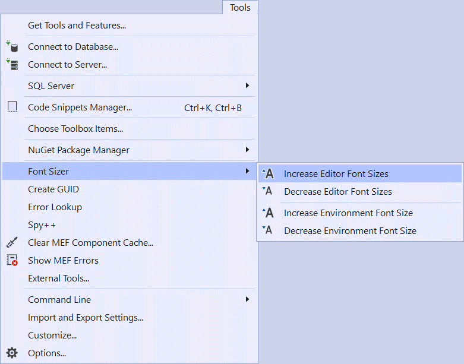

# Font Sizer

Download this extension from the [VS Marketplace](https://marketplace.visualstudio.com/items?itemName=KarlShifflettkdawg.FontSizer)
or get the [CI build](http://vsixgallery.com/extension/f7198797-d75d-4a7b-93c6-7bb56907735b/).

---------------------------------------

An easy way to change the font sizes in the editor and Visual Studio environment.

### Credits
A fork of the [FontSizer extension](https://github.com/craigeddy/FontSizer) that I updated to support Visual Studio 2019.

## Features
Quickly change the editor's font sizes or the environment's font size.

Recommend assigning shortcut keys to each of the 4 commands. These are the commands I use:

- CTRL + Num Pad Arrow Up = Increase editor font sizes
- CTRL + Num Pad Arrow Down = Decrease editor font sizes
- CTRL + Num Pad Arrow Right = Increase environment font size
- CTRL + Num Pad Arrow Left = Decrease environment font size

### Change Editor Font Size
Each time the respective Editor increase font size or decrease font size command is invoked the following changes are made:

- TextEditor changes by 2
- StatementCompletion changes by 1
- TextOutputToolWindows changes by 1
- Tooltip changes by 1
- CodeLensCategory changes by 1

### Change Environment Font Size
Each time the respective Editor increase font size or decrease font size command is invoked the environment font size is changed by 2.

## License
[Apache 2.0](LICENSE)
